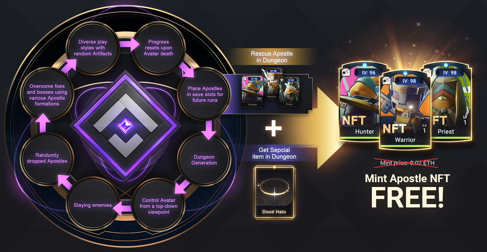

# Seasons

<figure><figcaption></figcaption></figure>

Setting ourselves apart from the traditional separation between game developers and players, Apeiron flourishes through a collaborative process. This is to say that as an NFT game, we cultivate Apeiron together with a supportive community of players from the onset. For that reason, our game is divided into different seasons, creating numerous opportunities to continuously engage with our community, pivoting and refining our gameplay based on their input in an ongoing process of development and growth.

This process is defined not merely by reciprocal feedback, but by a shared passion for the gaming realm. It is a meaningful exchange of ideas that forms the beating heart of Apeiron's evolution, creating a dynamic playground that blooms with the love from its creators and players. Thus, we aren't just building a game, but nurturing a universe, growing and evolving with the collective love and dedication of our community.

## Season 1

<figure><figcaption></figcaption></figure>

<figure><figcaption></figcaption></figure>

Season 1 marked the first release of Apeiron to the public as a minimal value product, giving an early demonstration of what our dungeon gameplay would look like moving forward. Season 1 also contained a bespoke story of a Tempest Wisdom Avatar facing down a boss monster who ate the mysterious Skydream Crown...

## Season 2

<figure><figcaption></figcaption></figure>

Apeiron Season 2: Apostle Awakening constituted our 2nd public release, an expansion of our "Battle Demo" containing a more robust version of our PvE roguelite dungeon gameplay. We added more room types (such as Event rooms), two more dangerous bosses, an Infinity Run dungeon mode, and two more Avatar classes (The Tempest Fury and Tempest Fate) for our players to enjoy.&#x20;

Season 2 was the first season wherein players could mint their own Apostle NFTs! This season made Hunter, Warrior, and Priest Apostles available for minting. Players could also earn Dood Halo and Doodelic Wings to get themselves two free mints.&#x20;

<figure><figcaption>
Free Mint Game Cycle
</figcaption></figure>

## Season 3 (Coming Q1 2024)

<figure><figcaption></figcaption></figure>

Our upcoming Season 3 releases marks the transition from the Apeiron Battle Demo to a full beta release. This season, players will not only be able to enjoy the roguelite PvE dungeon, but also begin their own exciting story as a godling, as well as try out the all new PvP arena mode. This season also marks the start of players being able to utilize their Planet NFT assets in-game!&#x20;

<figure><figcaption>
3 Cycles in S3
</figcaption></figure>

&#x20;
