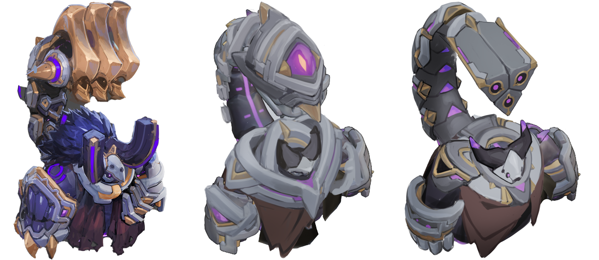
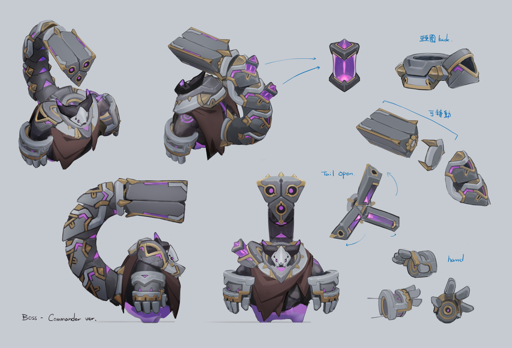
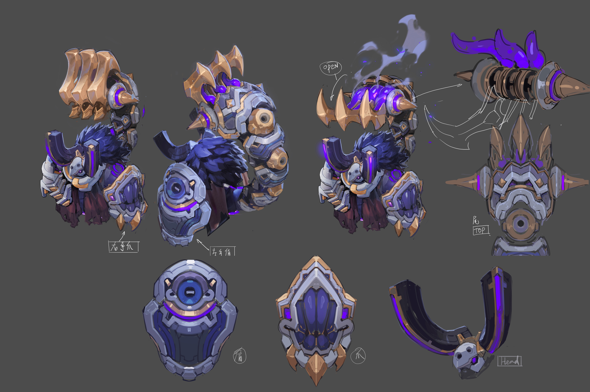

# Bosses

<figure><figcaption></figcaption></figure>

Bosses in Apeiron are no joke: they'll kill you, and fast, if you let them. You'll need to know what you're doing, as well as maybe get a little bit lucky, to beat 'em and make it further into the dungeon.&#x20;

Here are the bosses currently in the game:&#x20;

<figure><figcaption>
Concept Art for a Future Boss...
</figcaption></figure>

**Scorp the Juggernugget**

Scorp's a classic Juggernugget. He'll throw himself around causing mayhem and havoc with his giant body. But when he gets serious, you better watch out for the giant laser attack coming out of his massive tail.&#x20;

<figure><figcaption>
Concept Art for the Dark Mystic
</figcaption></figure>

**The Dark Mystic**

The Dark Mystic is a Juggernugget with a bit more magic. He can summon magical pillars to control the battlefield and do damage, and is also surprisingly maneuverable with his blink ability. Push the issue - press forward, don't let him get away!&#x20;

<figure><figcaption>
Conecpt Art for the Claw of DOOM
</figcaption></figure>

**The Claw of DOOM**&#x20;

The Claw of DOOM comes clad in heavy armor, making him a particularly thicc lad, even by Juggernugget standards. His signature move comes around the midway point in the battle, when he'll go in to grab one of your Apostles - or you - and deal massive damage.&#x20;
