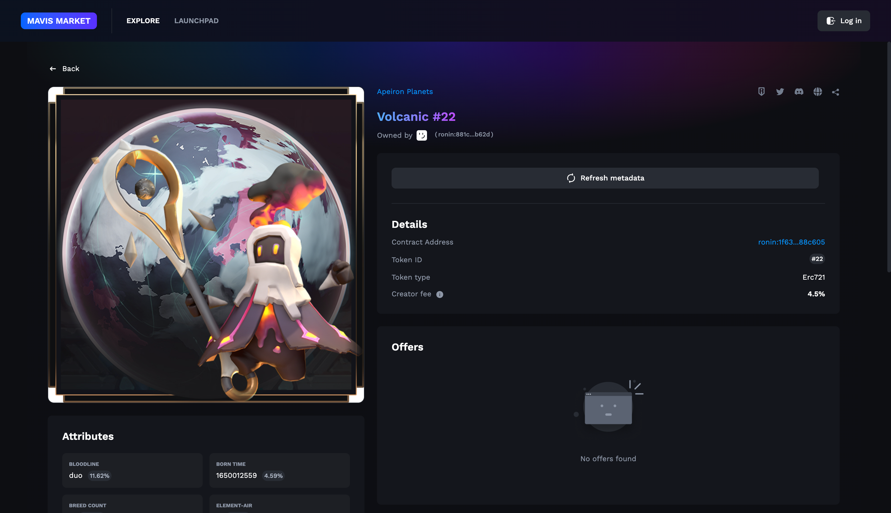

# Marketplace and NFTs

<figure><figcaption></figcaption></figure>

There will be three main kinds of NFTs in Apeiron: Planets, Stars and Relics. These NFTs are unique, non-fungible ERC 721 Tokens that can be bought and sold. They can be transferred to the sidechain in later phases. In the following pages, we'll talk about the different NFTs and what utilities they offer to the player. This page will go over where players may trade and interact with their Apeiron NFTs.

## The Apeiron Official Marketplace

<figure><figcaption>
The official Apeiron marketplace website
</figcaption></figure>

The Apeiron Marketplace website is your one-stop shop for all things Apeiron related. Not only can you purchase all major Apeiron NFTs here, but you can also breed Planets, manage your Stars, go out on Expeditions, download the Battle Demo, and more! If you haven't already, make sure you sign up for an account [here](https://marketplace.apeironnft.com/).&#x20;

Please note that the Apeiron Marketplace will be migrating to the Ronin blockchain as of Q4 2023.&#x20;

## OpenSea&#x20;

<figure><figcaption>
OpenSea
</figcaption></figure>

Apeiron has 3 collections on OpenSea: Apeiron Planets, the Apeiron Origins Collection, the Apeiron Godiverse Collection and Apeiron Stars. OpenSea was the biggest NFT marketplace in the early 20s, but it plans to stop the mandatory collection of resale fees for creators. Starting March 2024, those fees will essentially be tips.&#x20;

After migrating to the Mavis Marketplace, Apeiron NFTs will no longer be available on OpenSea.&#x20;

## Mavis Marketplace

<figure><figcaption>
Mavis Marketplace 
</figcaption></figure>

After migrating to the Ronin blockchain, Apeiron's NFT assets will be available both on the official  Apeiron Marketplace (Listed in terms of WETH) and on the Mavis Marketplace (Listed in terms of RON). The listings will be synced between the two marketplaces for a better user experience.&#x20;

## Currency: Wrapped ETH&#x20;

All NFTs will be sold in public marketplaces. Wrapped Ethereum (WETH) is the native currency for these marketplaces. To help users minimize costs and weather ETH gas fee fluctuations, we use sidechain tech and Wrapped Ethereum for stable marketplace operations. ETH supply increased by 2.3% per year while Bitcoin increased by 4% and the US dollar increased by almost 10% in 2021. Ethereum is currently transitioning from proof of work (PoW) to proof of stake (PoS), and once the process is complete, projected supply growth will become negative (around -1.9 % per year).

## Currency: RON

RON is the native cryptocurrency for the Ronin blockchain, a network designed primarily for the Axie Infinity game but now extended to other blockchain games like Pixel. It facilitates in-game transactions, aiming to enhance the gaming experience by skipping high transaction fees usually found in traditional systems.

