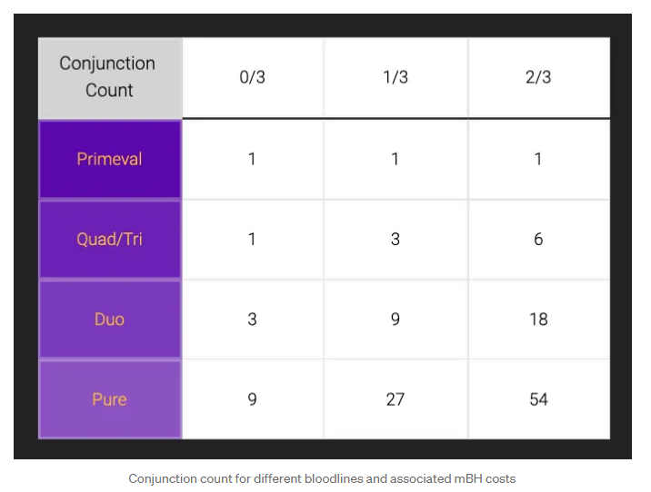

# Celestial Conjunction: Planet Breeding

**Planet Breeding:** Should a player acquire more than one Planet through the galactic NFT marketplace, they will be able to perform what is called a Celestial Conjunction. A Celestial Conjunction takes the Planetary Elemental Distribution and Traits of both parent Planets - their spiritual essence - and generates a new one. By repeating the process of Celestial Conjunction, players will be able to “breed” their own utopias. These new planets will be their own unique NFTs which can be either kept for play or sold on the marketplace. &#x20;

 (1).jpg>)

**Elemental Distribution:** Planets will have 100 elemental points distributed among the four traditional elements: Earth, Fire, Water, and Air. This distribution forms the basic attributes of a Planet, not only does it affect the Planet’s appearance, it also affects the types of objects the player and Doods can create. Furthermore, a more concentrated elemental distribution will give access to more powerful skills and miracles.&#x20;

**Breeding Tip:** Players can use Celestial Conjunction - Planet breeding - to concentrate their Planet's elemental distribution to get closer to a fully Pure Planet. When a new Planet is bred, it's elemental distribution will be affected by its parents. If you are a Planet owner, what this means is that you should breed Planets with matching elements — a Duo Planet of Fire and Earth, for example, you should breed with another Duo of Fire and Earth to try and get closer to either Pure Earth or Pure Fire.

**Breeding Requirements:**&#x20;

1. Two Planets
   1. The Planets cannot be directly related (parent, child, or sibling Planets)
   2. Each Planet can only be used in a Conjunction up to 3 times.&#x20;
2. APRS (or mBH) and ANIMA

<figure><figcaption></figcaption></figure>

**Primeval Legacy:** Primeval Legacy is a distinctive trait originally found in around 11% of Primeval Planets. This exclusive trait can be passed down to the next generation through breeding. Primeval Legacy traits GUARANTEE when breeding that your new Planet does not fall below a certain minimum threshold for the **dominant element**.&#x20;

For example, if one of your planets has the Primeval Legacy trait with a value of 80% Fire element, then, the new Planet will have a guaranteed value of at least 80% Fire, as long as the dominant element is Fire before triggering the Primeval Legacy effect. This can really help you to control the elemental distributions and get them lined up in the way you want.

But what if you have **multiple** Primeval Legacy traits of the same element from different parent Planets? In this case, whichever trait value is higher will be the one to activate. So for example, if one Planet had a Primeval Legacy ensuring 80% Fire, and another had a Primeval Legacy ensuring 50% Fire, only the 80% Fire Primeval Legacy would activate, assuming that the dominant element of the offspring Planet is Fire.

As of now, there are **two methods to acquire a planet with Primeval Legacy**, either by purchasing them from the [Marketplace](https://marketplace.apeironnft.com/marketplace/planets/items/?nftListingStatus=Listing\&primevalLegacyMax=62\&primevalLegacyMin=1\&sortBy=PriceAsc) OR through breeding with a Planet that has a Primeval Legacy and hoping the offspring inherits the trait. Specifically, if a new Planet is bred where a parent or grandparent has a Primeval Legacy trait, the offspring has a 10% chance of inheriting it per parent or grandparent that has that trait, up to a maximum inheritance chance of 60%.

<figure><figcaption>
A Primeval Legacy Planet on the Marketplace
</figcaption></figure>

**Planet Age:** Planet age is important for one reason: it unlocks more Relic slots. Relic slots allow players to insert Relic NFTs — powerful items or characters found across the godiverse — and use them for play for that particular planet. The older the planet, the more Relic slots it has! The more Relics, the more potential power you can boost into that planet.

When a planet is born, its age is set to 0, and it will increase by 1 every day. Once it reaches a certain age — shown in the table below — it will advance to the next age group, unlocking more relic slots. The earlier you breed, the better — as the more time passes, the older and more powerful the planet!

.png>)

You may not want to necessarily wait before your planet reaches the next age tier. In this case, the Sanctuary section of the Marketplace offers ways for you to speed up the aging process. Notably, through the rite known as **Chronomerging**, you can sacrifice one planet and automatically add its age to another’s. Additionally, aging can be sped up by positioning a planet next to a **Star**. More on that in the section on Stars below.
