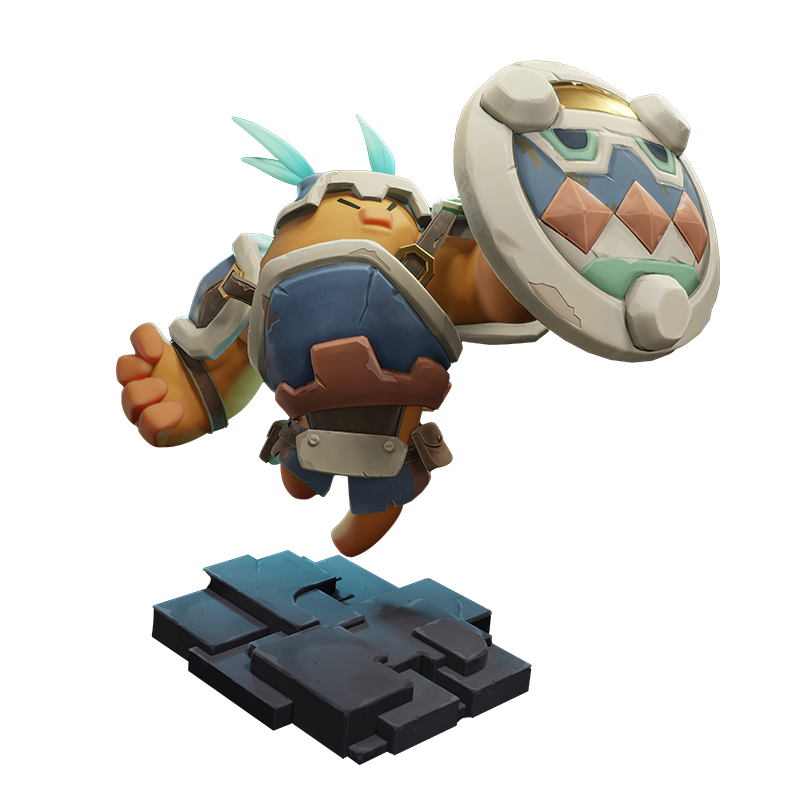
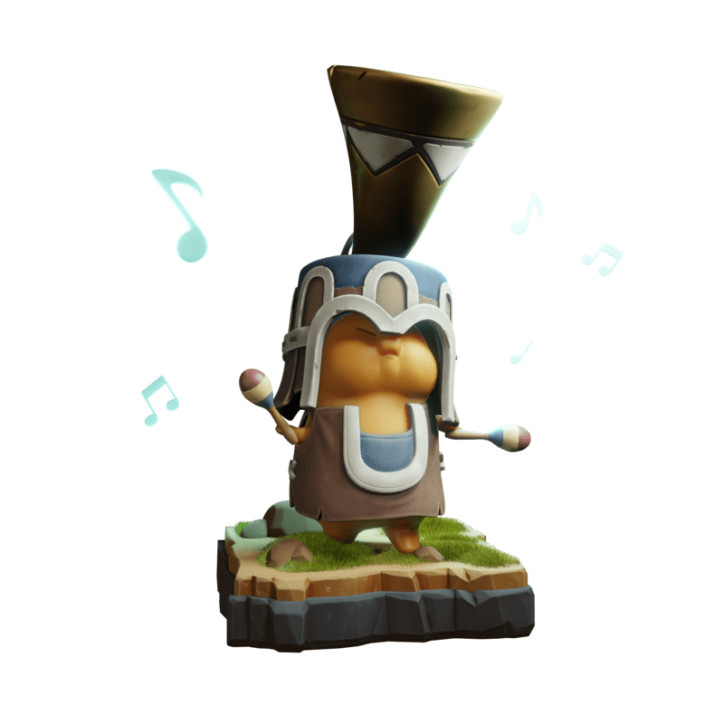
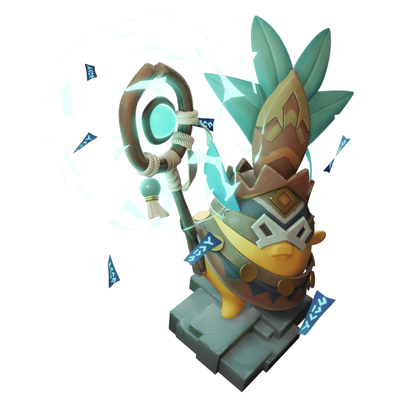
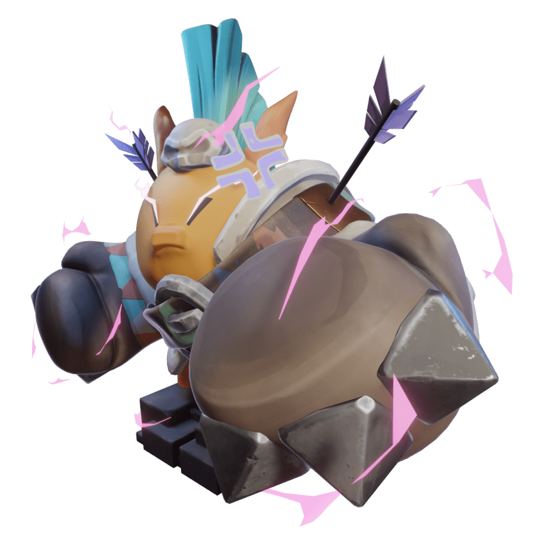

# Apostle Classes

### **Warrior**

<figure><figcaption></figcaption></figure>

Warriors are masters of both offensive and defensive combat, making them reliable frontline heroes while also being able to offer to good dps. They come with a diverse mix of close-combat skills and have decent health and armor, helping them to sustain themselves during drawn out fighting.

* Hobbies: Cooking, Hitting Things Very Hard
* Dislikes: Thinking, Not Eating
* Favorite Food: Doodburger

### **Mage**

<figure><figcaption></figcaption></figure>

Mages are intelligent (for doods) wizards that can call upon the powers of the celestial stars themselves to rain down fire on their enemies. The majority of Mage skills do Area of Effect (AoE) damage, but they also have a variety of unique skills that challenge you to think and play creatively.

* Hobbies: Telling Stories, Playing Tabletop Roleplaying Games
* Dislikes: Metagaming
* Favorite Food: Doodghetti and Meatballs

### **Rogue**

<figure><figcaption></figcaption></figure>

Rogues excel in assassinations. Using sneaky and stealthy skills, Rogues slide into position and then burst squishy targets, such as enemy casters. Taking out a Mage can be very powerful, but getting out from behind enemy lines is the tricky part.

* Hobbies: Stealing, Counting Money
* Dislikes: Being Accused of Stealing
* Favorite Food: Sugarmelon

### **Guardian**

<figure><figcaption></figcaption></figure>

Guardians protect their allies with defensive skills, acting as the team’s primary Tank. Perfect for holding off opposing enemy frontliners, they come with a number of CC and shielding abilities to keep the team safe from harm.&#x20;

* Hobbies: Listening to other Doods, Nodding Wisely
* Dislikes: Being Asked What's Going On
* Favorite Food: Fries

### **Hunter**

<figure><figcaption></figcaption></figure>

Hunters snipe out distant enemies with their long range skills and auto-attacks. They offer consistent single-target dps...if you can keep them safe. Hunters also come prepared with a variety of traps and attack speed buffing skills to keep the enemy on their toes.&#x20;

* Hobbies: Geeking out over Godling-sempai, Communing with Nature
* Dislikes: Doods Getting too Close to Godling-sempai
* Favorite Food: Ribbon Heart Rooberry Parfait

### **Priest**

<figure><figcaption></figcaption></figure>

Priests are your healers. They heal. They heal a lot. Keep your Priest alive and you won't go wrong, but be ready, because chances are the opponent will be throwing everything to get them down.&#x20;

* Dislikes: Overly Loud Music from those Darn Doodlings
* Hobbies: Lectures about Life, Conversations over Tea
* Favorite Food: Bam Sandwich

### **Bard**

<figure><figcaption></figcaption></figure>

Bard possesses musical power that can inspire allies to their fullest potential. With a collection of aura skills, Bards can buff allies in various ways (e.g. quickening abilities, healing or stat boosts) or debuff enemies with a nightmarish cacophony of noise.

* Dislikes: The Critics and the Haters
* Hobbies: Jamming at Concerts, Killing it on the dance floor&#x20;
* Favorite Food: Hamatail Sashimi

### **Summoner**

<figure><figcaption></figcaption></figure>

Summoners manipulate nature to the fullest - and that means both life AND death. While other heroes fight as a unit, Summoners represent a horde of forces, including tanky beasts, healing fairies self-exploding bugs, or even the spirits of departed Doods! Spooky.

* Hobbies: Napping, Looking into the Future
* Dislikes: Being Woken Up In the Middle of the Night by the Restless Dead (or other Doods)
* Favorite Food: Super Spicy Silken Ramen, Stinky Spikefruit

### **Shaman**

<figure><figcaption></figcaption></figure>

Shamans call upon the powers of dark magic and hexes to control the mind and spirit. They sacrifice blood for dangerous demonic strength and corrupt enemies with powerfully poisonous debuffs making them a potent threat in drawn out engagements.

* Hobbies: Chillin', Relaxin', Chillaxin'
* Dislikes: Arguing About Who Forgot to Cook Dinner
* Favorite Food: Surf'n'Turf

### **Knight**

<figure><figcaption></figcaption></figure>

Knights charge forward and disrupt enemy formations. Protected by heavy armor atop their mighty mounts, Knights use their mobility and inherent tankiness to constantly harass enemy units and expose weaknesses allowing the rest of the team to press the advantage.&#x20;

* Hobbies: Being Heroic, Taking Selfies with Fans
* Dislikes: Horsing Around
* Favorite Food: Prispite Popspicers

### **Dragoon**

<figure><figcaption></figcaption></figure>

Dragoons are versatile survivalists. With its mid-ranged attack, it bridges the gap between frontline and backline, providing both offensive and defensive potential to your team as and when you need it on the ever-changing battlefield.

* Hobbies: Fighting Bravely, Partying Wildly
* Dislikes: Doods Touching His Helmet Without Asking. No Touchy!
* Favorite Food: BBQ Meat Skewers

### **Berserker**

<figure><figcaption></figcaption></figure>

Berserkers live (and die) by the motto “Attack is the best defense”. Berserkers are natural brawlers, dealing massive melee damage to the enemy with fists of fury - and the more damage they take, the more damage they deal.

* Hobbies: Reading, Chilling with the Hunter
* Dislikes: BEING DISTURBED IN ANY WAY SHAPE OR FORM
* Favorite Food: Curry over Rice
