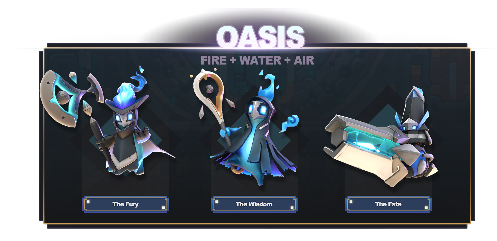

# Planet Types

Below is the list of 15 planet archetypes you’ll be able to breed in Apeiron and their consequent elemental combinations. Each planet type will have its own base Avatar skin depending on its class which will also come with several unique cosmetic items, so there’s a huge amount to discover:

1.  Gigas — Pure Earth: The Gigas Planets are those of Pure Earth. Soaring mountains tower to challenge the very heavens and the land itself is wrought on gigantic scale. \

    <figure><figcaption></figcaption></figure>
2.  Leviathan — Pure Water: The Leviathan Planets are those of Pure Water. The surface of these worlds is an endless ocean of profound depths, in which sea creatures of monstrous size ride the deep currents. \

    <figure><figcaption></figcaption></figure>
3.  Inferno — Pure Fire: The Inferno Planets are those of Pure Fire. Roaring flames greedily cover the world, unrelenting, in a constant dance of swirling heat and carbonizing color.  \

    <figure><figcaption></figcaption></figure>
4.  Tempest — Pure Air: The Tempest Planets are those of Pure Air. A constant storm bombards the Planet with blistering hail, pounding rain, vicious lightning, and booming thunder - a symphony of unceasing sound. \

    <figure><figcaption></figcaption></figure>
5.  Archipelago — Water/Earth: Archipelago Planets are duo-element worlds of Water and Earth. Gentle waves lap against island chains with sandy beaches where Doods hold frequent barbecues. \

    <figure><figcaption></figcaption></figure>
6.  Volcanic — Fire/Earth**:** Volcanic Planets are duo-element worlds of Fire and Earth. Doods here cower in fear at the constant threat of eruption, and must always be prepared to flee from an ensuing pyroclastic flow!\

    <figure><figcaption></figcaption></figure>
7.  Karsts — Earth/Air: Karst Planets are duo-element worlds of Air and Earth. Pillars of earth reach out to the sky longingly; here the Doods take more than a passing interest in climbing. \

    <figure><figcaption></figcaption></figure>
8.  Tundra — Fire/Water: Tundra Planets are duo-element worlds of Fire and Water. The snow and ice here is so cold it burns, so the Doods must wear special snowshoes as they go outside to watch the purple dancing lights in the sky. \

    <figure><figcaption></figcaption></figure>
9.  Delta — Water/Air: Delta Planets are duo-element worlds of Water and Air. These worlds are teeming with life and support verdant ecosystems, perfect for the Doods, who are ready to see if they can cook everything and anything. \

    <figure><figcaption></figcaption></figure>
10. Dunes — Fire/Air: Dune Planets are duo-element worlds of Fire and Air. These are desert worlds with more than a passing few giant sand worms, but they don’t stop Doods from rolling up and down the dunes joyfully. \

    <figure><figcaption></figcaption></figure>
11. Mountainous — Fire/Water/Earth: Mountainous Planets are tri-element worlds of Fire, Water, and Earth. Tall mountains and deep valleys define the surface, but what lurks below, in the hearts of the mountains? \

    <figure><figcaption></figcaption></figure>
12. Foresty — Water/Air/Earth: Foresty Planets are tri-element worlds of Water, Air, and Earth. From dew-filled jungles to brave pine forests, this is a world with mystery and adventure to uncover for inquisitive Doodexplorers.\

    <figure><figcaption></figcaption></figure>
13. Wasteland — Fire/Earth/Air: Wasteland Planets are tri-element worlds of Fire, Earth, and Air. The land here is pocked and scarred, empty of life - the Doods here are scavengers and bandits, picking at crumbs. \

    <figure><figcaption></figcaption></figure>
14. Oasis — Water/Fire/Air: Oasis Planets are tri-element worlds of Water, Fire, and Air. Much of the land here is covered with desert, but with the occasional pocket of plenty, where the Doods will congregate and have a bangin’ party.&#x20;

    <figure><figcaption></figcaption></figure>
15. Normal — Four Element mix: Normal Planets are a mix of all four-elements! The sky is the limit for these worlds - as a Godling, you can bend such a world in any direction as your divine plan dictates. \

    <figure><figcaption></figcaption></figure>
