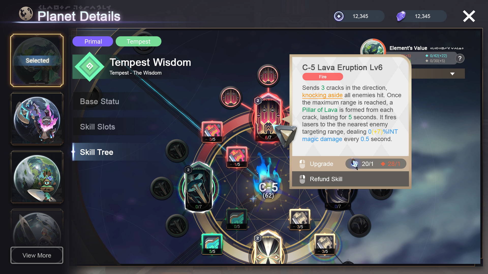

# Skill Tree

<figure><figcaption>
Skill Tree from an early PvP Build
</figcaption></figure>

## Avatar Skills

Your Avatar has access to a powerful Skill Tree that you can use to customize your own skillset and playstyle. This page will introduce the different Elemental Archetypes before discussing Birth Skills, Boons, Perks, and Skills.&#x20;

### Elemental Archetypes

Each Avatar can draw from Skills from the four elemental archetypes, each of which has its own strategic strengths and weaknesses.&#x20;

1. **Earth**\
   The Element of Earth is the element of defense and control. With the power of Earth, you can outlast the other elements, controlling the battlefield with powerful constructs of earth and vines. However, you'll need to keep your healers and shielders safe at all times, lest your formation collapse.
2. **Water**\
   The Element of Water is the element of balance and magic. With the power of Water, you'll be able to take on anything that your opponent brings to combat...but you'll have to rely on your own judgement of the flow of battle to gain any advantage.
3. **Fire**\
   The Element of Fire is the element of aggression and destruction. With the power of Fire, you can get off to a roaring start and decimate your opponent before they can get their feet under them. However, if you fail to get off to a strong start and the game begins to go longer, your flame may burn out.&#x20;
4. **Air**\
   The Element of Air is the element of speed and movement. With the power of Air, you can dance around your opponent, never letting them touch you before you slam them with thunderous blows. However, a single misstep and it'll all fall apart.&#x20;

### **Birth Skills**

**Birth Skills** are the starting set of skills for your Avatar. Depending on the Planet's background, it could have between 0-3 Birth Skills. Birth Skills can give you access to a powerful skill you might otherwise not be able to reach on the skill tree.&#x20;

### **Boons**

**Boons** are special passives and energized abilities unique to Planet Type that offer powerful build-around effects, and help to make the gameplay of each Planet Type meaningfully distinct.&#x20;

### **Skills**

**Skills** are unlocked by progressing up the Skill Tree. There are 5 tiers of skills on the Skill Tree. Players will receive a number of elemental points to spend on leveling up skills dependent on their Planet Type. For example, a Gigas Planet (Pure Earth) will receive 100 points to spend on leveling up Earth Skills. Players will need to spend points on lower tier skills and perks to unlock the higher tiers. Each skill can be leveled up multiple times to become more powerful; each skill also has three different upgrades that offer new effects to the skill to further empower it, offering players many different choices in the way they build their Avatar.

<figure><figcaption>
Zoomed out Skill Tree highlighting a Perk
</figcaption></figure>

### **Perks**

**Perks** are passives that may be invested in on the Skill Tree in a similar fashion to Skills. Perks offer a variety of effects - from build-around to mobility to tankiness to offensive power - as well as provide your Avatar with raw stats.&#x20;

