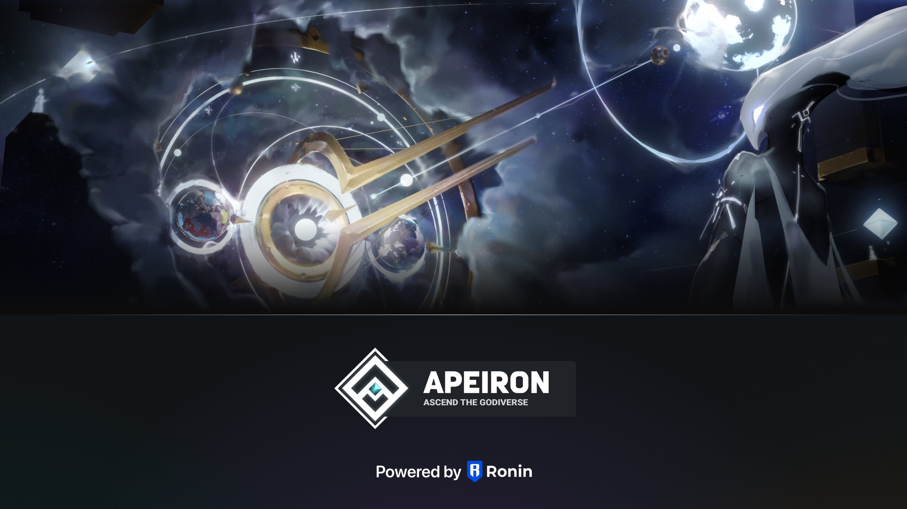

# Partners

<figure><figcaption>
Apeiron migrate from Polygon to Ronin @Dec 5
</figcaption></figure>

Apeiron's strategic partnership with Sky Mavis's Ronin Blockchain marks a significant milestone in our endeavor to redefine the landscape of web3 gaming. Sky Mavis, known for their work on popular web3 game _Axie Infinity_, bring a wealth of experience and outstanding technical expertise to our collaboration. More than that, it was their unwavering faith in our vision and dedicated commitment to our project that has solidified this partnership.

By leveraging the strengths of both Apeiron and Sky Mavis's Ronin chain, we aim to accelerate the evolution of web3 gaming characterized by engaging gameplay and nurturing a passionate community at its core. This alliance is not simply an intersection of technical strengths, but a collaborative journey towards achieving a shared vision of an immersive, fun-filled gaming experience grounded in our mutual commitment to the community. Drawing from Sky Mavis's strengths and Apeiron's innovative spirit, we envision a compelling web3 gaming universe where every interaction is a testament to this notable partnership.

[https://roninchain.com/blog/posts/welcome-to-ronin-apeiron](https://roninchain.com/blog/posts/welcome-to-ronin-apeiron)

[https://www.globenewswire.com/news-release/2022/04/25/2428615/0/en/Apeiron-is-raising-26-2M-to-Shake-Up-the-NFT-Gaming-Landscape.html](https://www.globenewswire.com/news-release/2022/04/25/2428615/0/en/Apeiron-is-raising-26-2M-to-Shake-Up-the-NFT-Gaming-Landscape.html)
