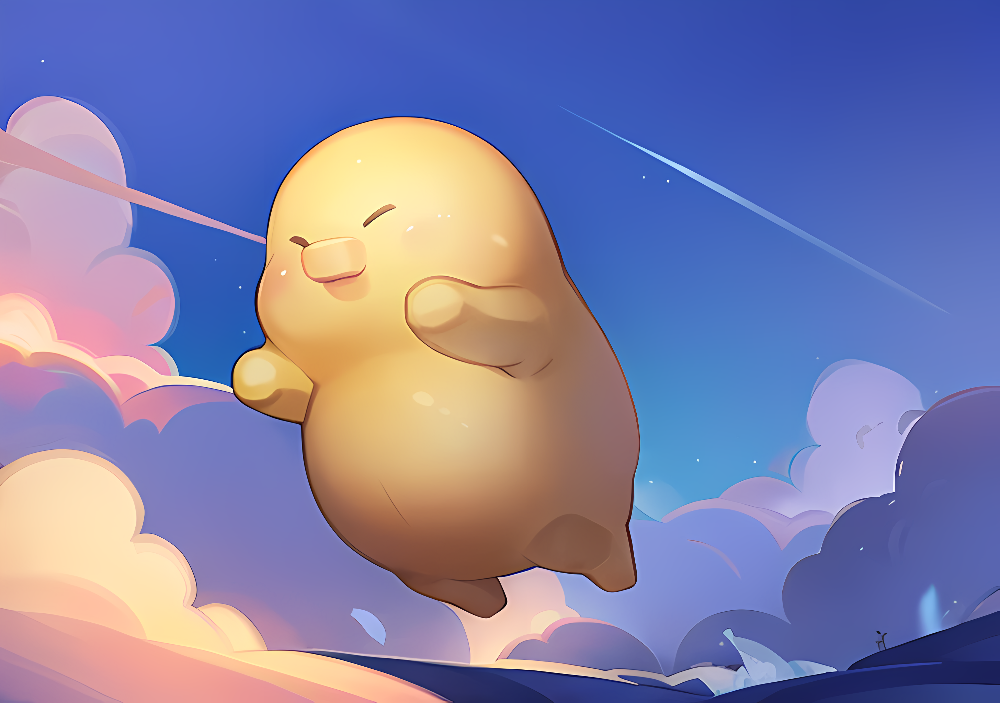

# Our Mission

The video gaming industry is only 50 years old, but its impact on global culture and economies have already surpassed many traditional entertainment industries such as movies and music. We believe one of the many factors to this meteoric growth is the industry's ability to embrace the latest technologies and turn them into engaging entertainment experiences even as we wrestle with the latest new changes in modern technology. Here at Foonie Magus, we believe these changes will ensure that Apeiron has the foundations in place to grow and thrive long into the future.

<figure><figcaption></figcaption></figure>

### Community first

We believe that, in the long term, it is a passionate community which will keep the game and the franchise going. [Our community](../community/) is not just a place to keep updated, it is also a fun and engaging platform to meet new friends and discuss interesting ideas. We will always be around, seeking opinions and suggestions from all walks of life to make a difference in our game. We have much to learn from each other and we want those who care to form the backbone of our community and ecosystem, not speculators who are here looking for quick profits. At the end of the day, gaming is more fun when we do it together.&#x20;

### AI Driven God Game

The recent advancement of AI is bringing forth disruptions and changes that no one can ignore. Not only will we integrate AI into Apeiron's gameplay and production, we will ensure this addition is mutualistic to the blockchain equation as well! In terms of gameplay mechanics, AI will empower our Doods and Apostles with an extra dimension of interactions that is reflective on both in-game and on-chain user actions. In terms of production, we will be training our own model to utilize our IP assets. The model will help us both to create new strains of artwork for in-game and promotional and to hasten our integration into other metaverses, realizing the dream of interoperability!

<figure><figcaption>
AI Generated Image of a Dood
</figcaption></figure>

### Player Ownership

Blockchain technology gave rise to two powerful new applications to gaming: user ownership and decentral tokenized economies. Players continue to spend more time and money in games today via in-app purchases and subscription-based services, yet those investments often come with intangibility and a disconnect from user ownership when it comes to business models and developer monetization. With NFTs and token economies, users can actually take the reins on how they want to be part of the the ecosystem, the business model itself. Players get to keep what they produce and trade with other players based on their own personal goals and aspirations. Apeiron is on the Ronin blockchain, which is a blockchain specifically dedicated to supporting gamers.&#x20;

