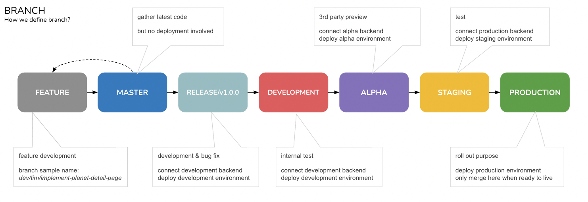

# README


HELLO\~

Welcome To **Foonie** Dev Team, Lets Enjoy and Works Together \~ 🍻\
[**Checkout ONBOARD if you are new »**](./#onboard-🚸)\\

### Portal 🚀

* [Onboard](./#onboard-)
* [Workflow](./#workflow-)
* [Branch](./#branch-)
* [Commit](./#commit-)
* [Pull Request](./#pull-request-)
* [Repository](./#repository-👾)
* [More](./#more)

### Onboard 🚸

**You need Computer**

Sure you need it, please ask your supervisor if you don't got one 🗿

**You need Access**

Before start working, please check you can access:

* Gmail
  * email is basic
  * {your\_name}@aitherentertainment.com
* Discord
  * we mainly talks on discord
  * use your own / use company gmail
  * join channel [web-frontend](https://discord.com/channels/935721630565552139/960125084268372028)
  * join channel [serverside](https://discord.com/channels/935721630565552139/952153677697781810)
  * join channel [smart-contract](https://discord.com/channels/935721630565552139/940077090819170405)
* Asana
  * we use it to assign / track task status
  * suggest use company gmail
  * join project [MarketplaceB](https://app.asana.com/0/1201597654850083/board)
  * join project [MarketplaceF](https://app.asana.com/0/1202365076394322/board)
* Slack
  * sometimes we use it, depends
  * suggest use company gmail
  * join workspace [ApeironBV](../apeironbv.slack.com)
* Github
  * our code goes [here](https://github.com/FoonieMagus)
  * please use company gmail
  * check if your icon appear on any [team](https://github.com/orgs/FoonieMagus/teams), should at least appear once
  * suggest set human readable name on [public profile](https://github.com/settings/profile) and [account](https://github.com/settings/admin)
  * btw, you surely have account, otherwise you can't read this 🗿
* Figma
  * our design / material goes [here](https://www.figma.com/files/project/50547631/Team-project?fuid=1103669907047356160)
  * please use company gmail
* Google Drive
  * our documents go [here](https://drive.google.com/drive/folders/1LEmqmC8iT2ySsSFr-Z8JcRzgSDgGBjNH)
  * please use company gmail
* GraphQL
  * try our [playground](https://api-marketpl-dev.apeironnft.com/graphiql)
  * feel free to try it out
* Kibana
  * check server log goes [here](../\(http:/18.136.241.0:9200/\_plugin/kibana/app/discover/#/?\_g=\(filters:!\(\),refreshInterval:\(pause:!t,value:0\),time:\(from:now-15m,to:now\)\)&\_a=\(columns:!\(method,path,level,msg,log\),filters:!\(\),index:f2e35880-e158-11ec-9337-6936773e9fcd,interval:auto,query:\(language:kuery,query:''\),sort:!\(\)\)\)) (debug)
  * you may need access on it, depends

### Workflow 🎢

**How we do normally**

* We use [asana](https://app.asana.com/0/1202365076394322/board) to keep track on new feature implement
* We use [github issue](https://github.com/FoonieMagus/ApeironMPFrontend/issues) to keep track on bug fixing
* We use discord to communicate

**How to manage your assana task**


[click to open](https://docs.google.com/drawings/d/1F\_9vf3WsgswAtaLhCsWxztwPZ8EqpLZHsFxb5gAj2D4/edit)

```sh
# task name sample
[Web | Feat | Conjunction] Select planets popup before conjunction
```

### Branch ↹

**You can Create**

* feature branch
  * branch to implement feature
  * example like `dev/[user name]/[feature name]`
* fix branch
  * branch to apply fix
  * example like `dev/[user name]/[fix summary]`
* developer branch
  * your own branch, you decide what to commit or push, only commit or push base on developer name
  * example like `dev/[user name]/master`

**How we define our product environments**



[click to open](https://docs.google.com/drawings/d/1BohxnPhz0b4sRSY3t7DBokxDbFt16IUkB7ZCCF9eN6g/edit)

**What should I do if I want to implement new feature?**


[click to open](https://docs.google.com/drawings/d/1GwBzSknZZZTsK99Lj\_371HR4VRQVxHyM9Fxk7\_RdrXc/edit)

```sh
# feature branch name format
dev/[user name]/[feature name]

# sample
dev/tim/implement-planet-detail-page
```

**What can I do if I need to hotfix?**


[click to open](https://docs.google.com/drawings/d/1--0Lgkp300QKrbETrcc5rGUjp4J\_vUdCEr07yOeIji0/edit)

```sh
# fix branch name format
dev/[user name]/[fix summary]

# sample
dev/tim/fix-planet-detail-page-missing-title
```

**What should I do if i want to prepare a stable release?**


[click to open](https://docs.google.com/drawings/d/1vdNqGAMuwYz1zrR\_uQyFp9yuBnQXoTRavKI88bKQSyU/edit)

### Commit 🧩

**Lets mind yourself before commits**

* Commit message should follow [conventional commit](https://www.conventionalcommits.org/en/v1.0.0/)

```sh
# commit message sample
fix: planet list display error
```

### Pull Request 🔎

**PR your teammate everytime, bother them**

* Don't direct push your commit to master / development / alpha / staging / production branch
* Any changes make should create a new branch, then submit a pull request
* Any pull request should gather 1 approval before merge
* Otherwise, no people know there is new commit merged 🗿

### Repository 👾

**ApeironMPFrontend**

* Checkout our web [repository](https://github.com/FoonieMagus/ApeironMPFrontend)
* You can follow [instruction](https://github.com/FoonieMagus/ApeironMPFrontend#getting-started) to start it on localhost
* Welcome to check on frontend [practice](https://github.com/FoonieMagus/ApeironMPFrontend) and feedback to us

### More

**Welcome contribution, WRITE DOWN SOMETHING ؂🖍**
