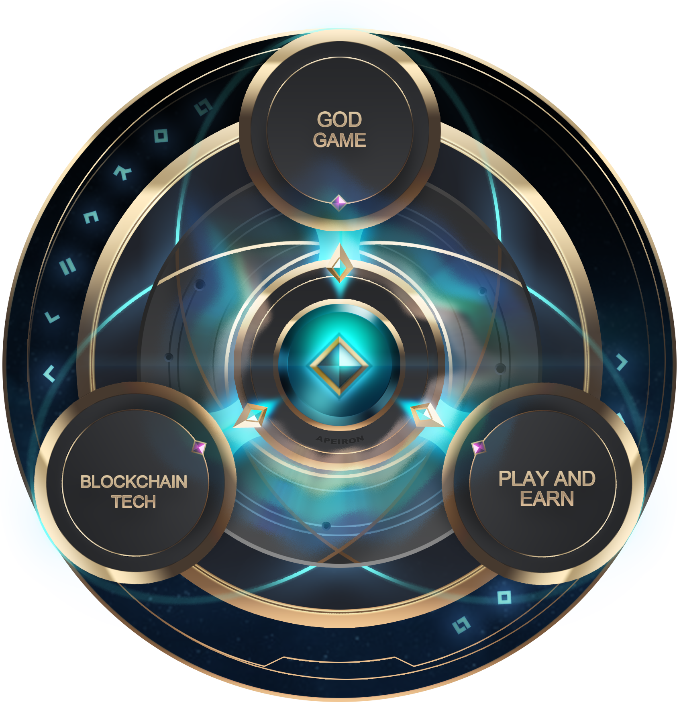

# Ascension: Introduction to Apeiron

To play at god. To wield the power of creation and destruction in the palm of your hands. To shape your own planet, guiding the rise and fall of civilizations. To weave the fabric of spacetime and bear witness to entire life cycles of the stars. Ascend to the heavens: welcome to the Apeiron universe. This whitepaper will outline the web3 god game Apeiron. Utilizing the flexible Unity development suite to weave together the simulation and action-RPG genre, Apeiron integrates old into new with the power of tangible-assets and a player-driven economy. This document is not to be confused with a technical or economics whitepaper, but rather one that will serve as an introduction to the Apeiron metaverse for pioneering enthusiasts.

