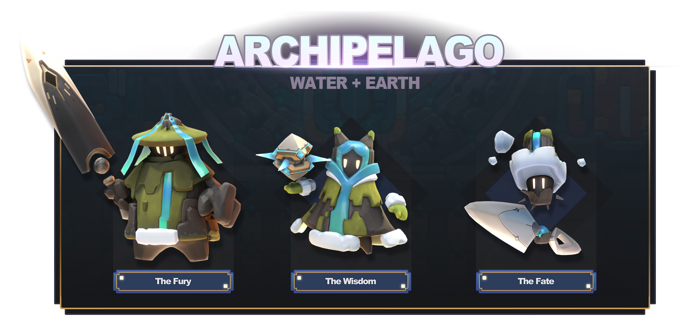
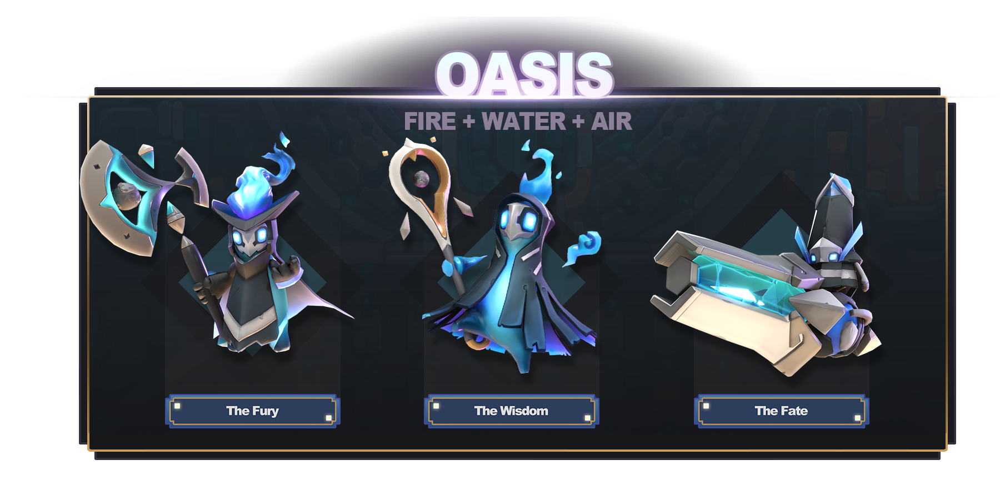

# 柱I : 神視点のシミュレーション

## 惑星

基本概念：惑星と交流するために、ゴッドリングは、スピリット・コアを受け取ると、惑星の表面に点在する神秘的な構造をしたエデンに宿ります。エデンに宿るためには惑星を所有する必要があります。惑星はマーケットプレイス（柱 III：NFT参照）で購入できます。あなたのスピリット・コアがエデンを支配すると、あなたはその惑星の要素を思い通りに形成し、好みの環境へと成長させることができるようになります。

* 各惑星にはエレメンタルの種類とアバターの戦闘クラスがあり、プレイヤーはアクションRPGゲームプレイで利用するためのスキルカードにアクセスできます。
* また、各惑星にはさまざまなダンジョンがあり、ダンジョンを探査することで、ドゥードアポストル追加隊員たちを解放することができます。
* ゲームを試してみたいプレイヤーは、パートナーゲーミングギルドに連絡し、譲渡不可能な「シード惑星」を入手することで、Apeironを無料で体験していただくことができます！

以下はApeironで繁殖できる15アーキタイプの惑星と、それに伴うエレメンタルコンビネーションの一覧です。各惑星タイプにはベースとなるアバタースキンがあり、クラスによってユニークな外観アイテムが用意されています。

1. ギガス — 土：ギガス惑星は純粋な土の惑星です。天を突くようにそびえ立つ山やスケールの大きな大地が広がっています。ギガスアバターは最高レベルの土属性スキルカードにアクセスすることができます。\
   .png>)
2. リヴァイアサン — 水：リヴァイアサン惑星は純粋な水の惑星です。果てしない海には、海洋生物が海底の海流に乗って泳いでいます。リヴァイアサンアバターは最高レベルの水属性のスキルカードにアクセスできます。\
   .png>)
3. インフェルノ — 火：インフェルノ惑星は純粋な火の惑星です。貪欲に燃え盛る炎が世界を覆い尽くし、絶え間なく熱と炭が舞い踊っています。インフェルノアバターは最高レベルの火属性のスキルカードにアクセスできます。\
   
4. テンペスト — 風：テンペスト惑星は純粋な風の惑星です。絶え間ない嵐が惑星を雹（ひょう）や豪雨、稲妻、雷で覆い、途切れることのない音を奏でています。テンペストアバターは最高レベルの風属スキルカードにアクセスできます。\
   .png>)
5.  アーキペラゴ — 水/土：アーキペラゴ惑星は水と土の元素からなる惑星です。穏やかな波が島に打ち寄せ、砂浜ではドゥードがバーベキューを楽しんでいます。アバターは土と水の強いスキルカードにアクセスできます。\

    
6. ボルカニック — 火/土：ボルカニック惑星は火と土、2つの元素からなる惑星です。ドゥードは常に噴火の脅威にさらされ、どんなときも火砕流から逃げる準備をしておかなければなりません！アバターは火と土の強いスキルカードにアクセスできます。\
   
7.  カルスト — 土/風：カルスト惑星は風と土、2つの元素からなる惑星です。土柱が空へ向かって伸びており、ここではドゥードたちは登山に興味を持っています。アバターは、風と土の強いスキルカードにアクセスできます。\

    
8. ツンドラ — 火/水：タンドラ惑星は火と水、2つの元素からなる惑星です。雪と氷は焼けるように冷たく、空を舞う紫の光を見るためにドゥードたちは特別なスノーシューズを履かなければなりません。アバターは火と水の強いスキルカードにアクセスできます。\
   .png>)
9. デルタ — 水/風：デルタ惑星は水と風、2つの元素からなる惑星です。生命溢れ緑豊かなエコシステムを持つこの世界は、見るものをなんでも調理してしまうドゥードに最適です。アバターは、水と風の強いスキルカードにアクセスできます。\
   
10. デューンズ — 火/風：デューンズ惑星は火と風の2つの元素からなる惑星です。巨大なサンドワームが存在する砂漠の世界ですが、ドゥードたちは楽しそうに砂丘を転げ回っています。アバターは、土と火の強いスキルカードにアクセスできます。\

    
11. マウンテンナス — 火/水/土：マウンテンナス惑星は、火と水と土の3つの元素からなる惑星です。高い山々と深い谷が地表を形成していますが、その山の下には何が潜んでいるのでしょうか？ アバターは火と水と土の様々なスキルカードにアクセスできます。\

    
12. フォレスティ — 水/風/土：フォレスティ惑星は水と風と土の3つの元素からなる惑星です。雨の滴が輝くジャングルから勇敢な姿の松林まで、ここは好奇心旺盛なドゥードエクスプローラーのための謎と冒険に満ちた世界です。アバターは風、水、土の様々なスキルカードにアクセスできます。

    
13. ウェイストランド — 火/土/風：ウェイストランド惑星は火と土と風の3つの元素からなる惑星です。この土地は荒れ果てた空虚な場所です。ここにいるドゥードたちは、ゴミを漁るスカベンジャーや強盗です。アバターは火、風、土の様々なスキルカードにアクセスできます。\
    
14. オアシス — 水/火/風：オアシス惑星は水と火と風の3つの元素からなる惑星です。大部分は砂漠で覆われていますが、時々豊かな場所があり、そこでドゥードたちは集まって賑やかなパーティーを楽しんでいます。アバターは火、水、風の様々なスキルカードにアクセスできます。

    
15. ノーマル — 4つの元素ミックス：ノーマル惑星は、なんと4つの元素をミックスしたものです！無限の可能性を秘めたゴッドリングであるため、聖なる計画に沿って自由に操ることができます。アバターは、全ての元素スキルカードといくつかのニュートラルなスキルカードにアクセスできます。\

    

## 神をテーマにしたゲーム

**ミラクル：**エデンを使うと、ミラクル、つまり奇跡を起こすことができます。ミラクルは、4つの基本エレメントである土、水、風、火の環境と結びついています。エレメントを通してプレイヤーは世界を形成していき、ドゥードはそれに反応します。雨を降らせて作物を育てることや、山を崩し鉱石で街を作ることができます。あなたに従わないフォロワーには火の玉を投げて従わせることも可能です。

* エデンのレベルが上がると、より強力なミラクルや惑星の機能をアンロックすることができます。基本のミラクルを組み合わせ、新しい可能性を作り出すことができます。例えば、風と水は氷を生み、環境とドゥードの形成する社会に新たな展望をもたらします。&#x20;
* 特定のミラクルを組み合わせたり、繰り返し使ったりすると、さまざまな環境オブジェクトが形成されます。水と土のミラクルを組み合わせて、大地に栄養を与え、青々とした森を作ることができます。また、火のミラクルでは溶岩湖を作ることができます。
* プレイヤーはミラクルを使って惑星を発展させると、戦闘デッキに新しいスキルカードを追加することができます。

**属性：**ミラクルを起こすと、属性が善悪のどちらかに移動します。ドゥードフォロワーがプレイヤーに捧げる祈りに応えると、属性は善へ傾き、特別なスキルやクエストを解放し、世界は幸せに満ちた場所になります。反対に、ドゥードを何度も罰すると、属性は悪となり、それに伴う内容がアンロックされ、世界は徐々に地獄絵と化します。

* 属性を最大化すると、ドゥードによるプラネットワンダーの建設や、ユニークな英雄ドゥードを出現させる可能性が高まります。

**ドゥード：**ゲーム開始時にプレイヤーに解放されているのは惑星の一つの大陸だけで、そこにはドゥードの小さなコミュニティがあります。プレイヤーに与えられた最初のタスクは、彼らの要求を聞きミラクルを起こし、ドゥードをフォロワーにすることです。ドゥードはミラクルや生成されるオブジェクトに好みがあり、彼らの要求を満たす最良の方法を考えることがプレイヤーの腕の見せ所です。ドゥードフォロワーを十分集めることができれば、エデンのレベルが上がり、新しい大陸を解放し、さらなるドゥードフォロアーを開拓することができます。

## ローグライク: アルマゲドン&#x20;

**アルマゲドン：**時間の経過と共に、惑星はプレイサイクルの終わりを迎えます。ドゥードの社会が最大限まで拡大すると、それ以上拡大することはなくプラトーに達します。こうなると、プレイヤーはアルマゲドンを発動することができます。アルマゲドンを発動させることは、事実上惑星を「リセット」することになりますが、その時一定量のソウルジェムが与えられ、それを使用してプレイヤーのスピリット・コアをアップグレードし、パッシブボーナスやアクティブボーナスを永久的に増やすことができます。

* アルマゲドンには2つの選択肢があります：プレイヤーは、ドゥードのために慈悲深い「歓喜」を行うか、悪意のある「生け贄」を行うことができます。前者は永続的なボーナスと少量のソウルジェムが与えられ、後者は大量のソウルジェム（もしかするとある程度の罪悪感も）が与えられます。
* さらに、アルマゲドンは遊んで稼ぐトークン「アニマ」を大量に生み出します。惑星を最大限まで発展させるとした場合、プレイヤーは1惑星につき毎週1回アルマゲドンを実行することができます。

リセット中、プレイヤーはゲームのオブジェクトをNFT（柱 III: NFT - レリックスを参照）に交換する機会が与えられます。ただし、それを行うにはトークンを消費しなければなりません。トークンとNFTはどちらも仮想通貨と交換が可能なので、プライヤーはApeironのマーケットプレイスの利用を促されると言う特徴があります。

* プレイヤーが惑星をリセットするたびに、惑星のエレメンタル分布に基づき新しい大陸が無作為に生成され、毎回新鮮なゲームプレイが楽しめます。

プレイヤーがスピリット・コアのレベルを上げていくと、より多くのソウルジェムが必要となり、大規模なリセットが必要となってきます。言い換えると、他の惑星へ進出する必要があります。他の惑星を手に入れるには、Apeironマーケットプレイスを活用する必要があり、遊びながら稼ぐゲームプレイループが強化される仕組みとなっています。
