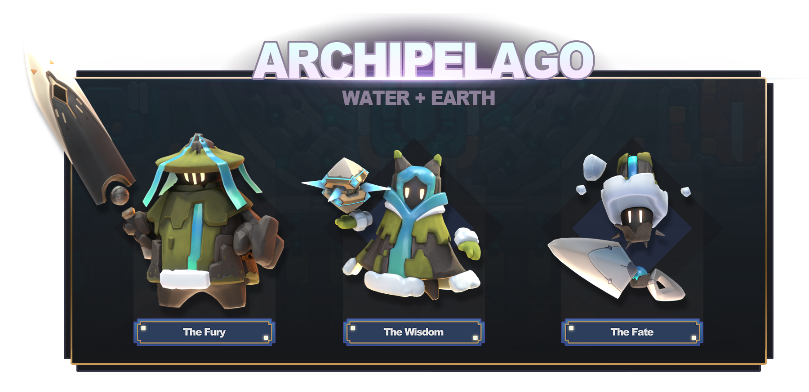

# 核心支柱1：上帝模拟游戏

## 行星

**基础知识:** 为了与行星互动，你的神灵将带着它的神核心居住在伊甸园中，大多数行星表面上都有的神秘建筑。你需要拥有一个行星才能居住在它的伊甸园里，行星可以从公开市场购买。一旦你的神核心控制了你所拥有的行星上的伊甸园，你将拥有控制该行星元素的力量，可以按照你的意愿来塑造和发展行星。&#x20;

* 每个行星都有自己的元素类型和守护神战斗职业，让玩家可以使用一组独特的技能卡来进行动作角色扮演玩法。
* 每个行星也会有自己的地下城供玩家探索，玩家可以通过这些地下城解锁更多的杜德使徒成员。
* 想要试玩游戏的玩家可以联系我们合作的游戏公会，以获得不可转让的「种子行星」，这样就可以免费体验 Apeiron 的游戏玩法！

以下是玩家可以在 Apeiron 中繁殖的 15 种行星原型及其元素组合列表。每种行星类型根据其守护神职业都会有自身独特的基础守护神，因此有大量的不同组合：

1. 渊渟岳峙（Gigas）——纯土：渊渟岳峙行星是纯土元素行星。巍峨的群山耸立，挑战着苍穹，拥有广阔无垠的大地。守护神将获得最高等级的土元素技能卡。\
   .png>)
2. 永久冰壁（Leviathan）——纯水：永久冰壁行星是纯水元素行星。世界表面是无边无际的深海，巨大的海洋生物在其中乘风破浪。守护神将获得最高等级的水元素技能卡。\
   .png>)
3. 熔岩地狱（Inferno）——纯火：熔岩地狱行星是纯火元素行星。世界表面舞动着熊熊炽焰，无止境地燃烧。守护神将获得最高等级的火元素技能卡。\
   
4. 天空彼岸（Tempest）——纯风：天空彼岸行星是纯风元素行星。无休止的风暴夹带着猛烈的暴雨冰雹，闪电飞光，雷声轰鸣，持续不断地轰击着行星，如同连锦不绝的交响乐。守护神将获得最高等级的风元素技能卡。\
   .png>)
5.  列岛（Archipelago）——水/土：列岛行星是水和土双元素行星。温和的海浪拍打着岛链的沙滩，杜德经常在那里烧烤。守护神将获得强大的土和水元素技能卡。\

    
6. 火山（Volcanic）——火/土：火山行星是火和土双元素行星。在这里，杜德因受到火山喷发的持续威胁而畏缩不前，而且必须时刻准备逃避火山喷发后随之而来的火山碎屑流！守护神将获得强大的火和土元素技能卡。\
   
7.  岩溶地貌（Karsts）——风/土：岩溶地貌行星是风和土双元素行星。地柱充满渴望地伸向天空，在这里，杜德对攀岩可不仅仅是一时之趣。守护神将获得强大的风和土元素技能卡。\

    
8. 冰川冻原（Tundra）——火/水：冰川冻原行星是火和水双元素行星。这里的冰雪冷得足以造成灼伤，杜德必须穿上特制的雪鞋才能到户外观看天空中的紫色舞光。守护神将获得强大的火和水元素技能卡。\
   .png>)
9. 三角洲（Delta）——水/风：三角洲行星是水和风双元素行星。这里的世界充满生机，维持着葱茏的生态系统，非常适合杜德，他们随时准备着看自己是否能烹煮任何东西。守护神将获得强大的水和风元素技能卡。\
   
10. 沙丘（Dunes）——火/风：沙丘行星是火和风双元素行星。这里的沙漠世界不止有几条的巨大沙虫，但也并不妨碍杜德快乐地在沙丘上滚来滚去。守护神将获得强大的火和风元素技能卡。\

    
11. 巨岩（Mountainous）——火/水/土：巨岩行星是火、水和土三元素行星。高耸的山脉和深邃的山谷构成了地表，但在山的深处，隐藏着什么呢？守护神将获得多样化的火、水和土元素技能卡。\

    
12. 森林（Foresty）——水/风/土：森林行星是水、风和土三元素行星。对于好奇的杜德探险家来说，无论是满盈露水的丛林还是壮丽的松树林，都是一个充满神秘和冒险的世界。守护神将获得多样化的水、风和土元素技能卡。\

    
13. 荒漠（Wasteland）——火/土/风：荒漠行星是火、土和风三元素行星。 这里的土地坑坑洼洼、布满伤痕，没有生命；这里的杜德是拾荒者和强盗，什么都不会放过。守护神将获得多样化的火、土和风元素技能卡。\
    
14. 绿洲（Oasis）——水/火/风：绿洲行星是水、火和风三元素行星。这里的大部分土地都被沙漠覆盖，但偶尔也会有一小块富饶的土地，杜德会在那里聚集并举办狂欢派对。守护神将获得多样化的水、火和风元素技能卡。

    
15. 常态（Normal）——四元素混合：常态行星是所有四种元素混合的行星！天空是这些世界的极限——作为一个神灵，你可以按照你的神圣计划将这样的世界朝任意方向发展。守护神将获得所有元素技能卡和一些中性技能卡。\

    

## 上帝模拟游戏

**奇迹：**玩家可以通过伊甸园创造奇迹。奇迹通过四种传统元素与环境联系在一起：土、水、风和火。通过它们，玩家可以塑造世界，而杜德会做出相应的反应。降下雨水可以帮助他们种植庄稼，劈开山脉能为他们提供建造城市所需的矿石。又或者，如果你的追随者让你感到不快，施放火球会令他们对你俯首称臣。

* 随着玩家升级他们的伊甸园，将会解锁更强大的奇迹和行星功能。基础奇迹组合起来也许会诞生新的可能性，例如：风和水创造出了冰，这将开启环境和你的杜德社会新的潜在互动。
* 不同的环境物件可以通过组合或重复使用某些奇迹来形成。用水和土元素的奇迹来滋养大地，从而创造出一片充满青翠树木的森林；或者不断用火元素奇迹来创造熔岩湖。
* 随着玩家使用奇迹来开发他们的行星，他们将能够在战斗卡组（Combat Deck）中添加新的和有趣的技能卡。

**善恶值：**当玩家在创造奇迹时，善恶值会趋向善或者恶。杜德追随者会向玩家进行祈祷。以仁慈的方式回应他们，你的善恶值将朝着善的方向发展，为你的世界开启特殊技能、任务和天使般的外观；反之，如果你一再因为杜德的冒失而惩罚他们，你的善恶值就会转向恶的方向发展——也会有它独特的解锁内容，并慢慢地将世界转变成恶魔般的地狱。

* 如果玩家将他们的善恶值最大化，有机会让他们的杜德建造出特殊的行星奇观或者出现独特的杜德英雄。

**杜德：**在游戏开始时，行星上只有一个大陆对玩家开放，其中会有一个小型的杜德社区。玩家的首要任务是通过倾听他们的需求并创造相应奇迹，将这些杜德转变为追随者。杜德会对在环境中创造的奇迹和物件有自己的偏好，这将取决于玩家如何最好地满足他们的需求。在将足够多的杜德转化为追随者后，伊甸园建筑将升级，开辟出更多可供探索的大陆和更多可供转化的杜德。

## Roguelike：大审判（Armageddon）&#x20;

大审判 **：**随着时间的推移，行星将到达其游戏周期的终点。杜德社会已尽其所能地扩张并开始停滞不前。此时，玩家可以选择发起大审判。这将有效地「重置」行星，获得一定数量的灵魂宝石，可用于升级玩家的神核以获得永久的被动和主动奖励。

* 大审判有两种选择：玩家可以对自己的杜德进行仁慈的被提或恶毒的献祭。前者会获得持续的奖励和少量的灵魂宝石，而后者只会给玩家大量的灵魂宝石（以及一定程度的潜在愧疚感）。
* 此外，大审判将会产生大量的 Anima ——我们的边赚边玩代币。假设玩家已经将行星发展到上限，那么玩家将能够每周对每个行星执行一次大审判事件。&#x20;

在重置期间，玩家有机会将他们的一些游戏物件铸造成 NFT（详见核心支柱3：非同质化代币（NFT） - 圣物），但需花费代币。代币和 NFT 都鼓励玩家积极参与到 Apeiron 市场中，因为它们都可以兑换成加密货币。

* 每次玩家重置他们的行星时，都会根据行星的元素分布随机生成新的大陆，让每个周期的游戏玩法保持新鲜和有趣。

随着玩家不断升级神核，他们会发现需要越来越多的灵魂宝石，需要更大量的重置：换而言之，需要更多的行星。为了获得更多的行星，将促使他们在 Apeiron 市场上活跃起来，从而充实「既玩且赚（play-and-earn）」的游戏循环。
