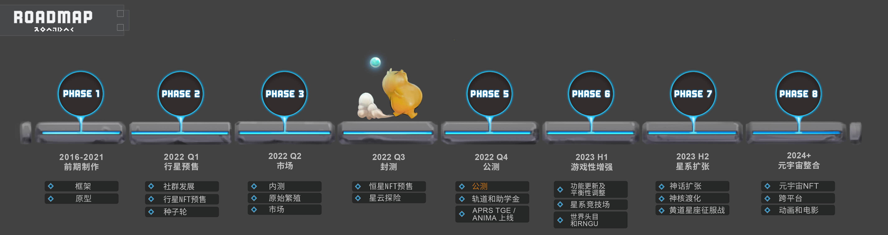

# 宇宙演化：元宇宙的诞生

为了实现 Apeiron 元宇宙的宏伟愿景，随着我们达到每个发展里程碑时，通过资产出售来筹集资金的方案将分阶段公布。

### 第一阶段：前期制作 2016-2021

* 世界设定和故事概要、游戏设计框架和艺术指导 ✔️
* 通过概念验证的原型 ✔️
* 完善三代币经济和 NFT 游戏循环机制 ✔️
* 和家人和朋友完成前种子轮融资 ✔️

### 第二阶段：行星 NFT 预售 2022 Q1

* 通过社群和可玩的 NFT 空投活动进行社群扩展活动 ✔️
* 第二阶段可用的游戏资产有：
  * 启源使徒圣物 NFT 赠品 ✔️
  * 顶级基金和游戏公会的种子轮 ✔️
  * 行星 NFT 预售 ✔️

### 第三阶段：Alpha 版本 & 市场 2022 Q2&#x20;

* Alpha版本的内部测试 ✔️
* 浏览器版的市场上线 ✔️
* 原始天合 （原始行星繁殖）上线 ✔️

### 第四阶段：封测 & 恒星预售 2022 Q3

* 与合作伙伴和原始行星拥有者进行封测
* 星云探险（NFT & 代币质押）和 商场（行星交易）功能在市场开放
* 恒星NFT通过星辰宝箱预售

### 第五阶段：游戏发布 2022 Q4

* 玩家可以进入 Apeiron 的 Beta 公测版。公测版将包含完整的战斗和竞技场机制，以及简化的模拟和地下城机制。
* &#x20;APRS 代币生成活动（TGE）和 ANIMA 代币上线
* 激活轨道并推出助学金（Scholar）

### 第六阶段：游戏性增强 2023 Q1

* 功能更新及平衡性调整。
* 玩家可以参与官方 PvP 星系竞技场，以获得他们的守护神排名。
* 世界Boss上线
* 第三种代币「Ringularity」将被引入。

### 第七阶段：星系**扩张** 2023 Q3

* 神话星系和星系进程活动将会推出。玩家将参与到秩序与混沌势力之间宏大磅礴的冲突中。
* 神核NFT预售及渡化
* 黄道星座征服战开启

### 第八阶段：元宇宙整合 2023 Q4&#x20;

* 引入元宇宙 IP 和所有权收益分割协议&#x20;
* NFT 合作伙伴关系和跨平台游戏
* Apeiron动画短片及电影

<figure><figcaption></figcaption></figure>
