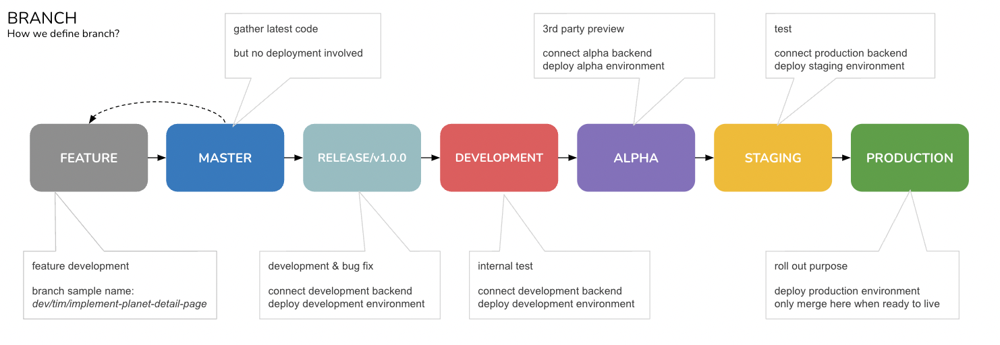
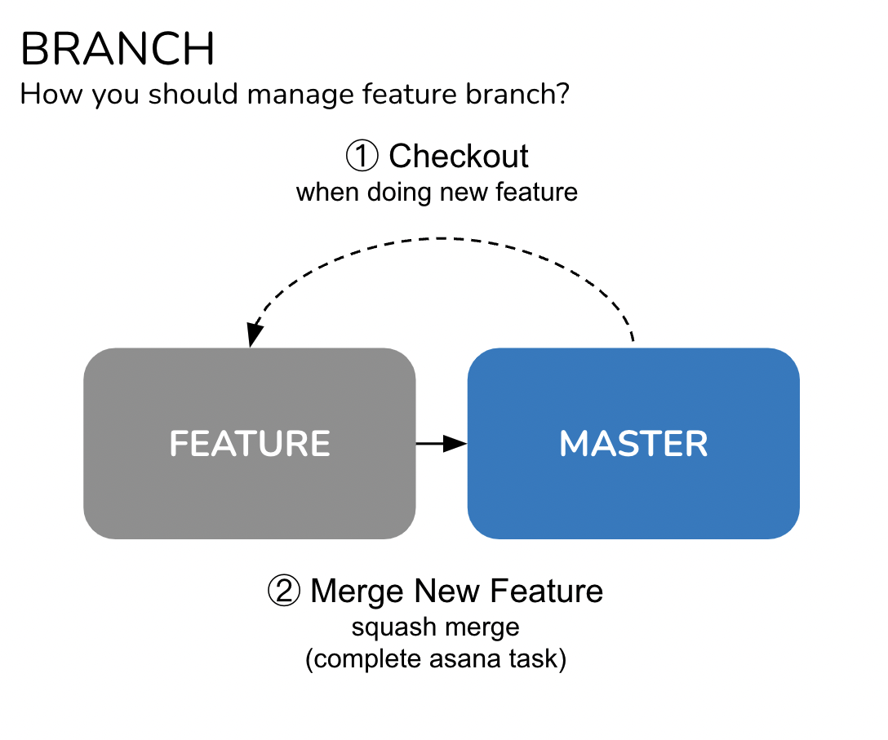
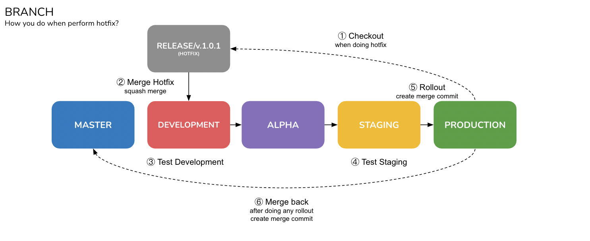

# 自述文件 {#readme}


欢迎加入**Foonie**开发团队，让我们一起享受和工作吧 \~ 🍻\
[**如果您是新手，请查看 ONBOARD »**](./#onboard-🚸)\

### 传送门🚀 {#portal}

-   [在船上](./#onboard-)
-   [工作流程](./#workflow-)
-   [分支](./#branch-)
-   [犯罪](./#commit-)
-   [请求请求](./#pull-request-)
-   [存储库](./#repository-👾)
-   [更多的](./#more)

### 船上🚸 {#onboard}

**你需要电脑**

当然需要，如果没有请询问您的主管🗿

**您需要访问权限**

在开始工作之前，请检查您是否可以访问：

-   邮箱
    -   电子邮件是基本的
    -   {你的名字} [\@aitherentertainment.com]{.citation
        cites="aitherentertainment.com"}
-   不和谐
    -   我们主要讨论不和谐
    -   使用您自己的/使用公司的 Gmail
    -   加入频道[网络前端](https://discord.com/channels/935721630565552139/960125084268372028)
    -   加入频道[服务器端](https://discord.com/channels/935721630565552139/952153677697781810)
    -   加入渠道[智能合约](https://discord.com/channels/935721630565552139/940077090819170405)
-   体式
    -   我们用它来分配/跟踪任务状态
    -   建议使用公司gmail
    -   加入项目[MarketplaceB](https://app.asana.com/0/1201597654850083/board)
    -   加入项目[MarketplaceF](https://app.asana.com/0/1202365076394322/board)
-   松弛
    -   有时我们会使用它，取决于
    -   建议使用公司gmail
    -   加入工作区[ApeironBV](apeironbv.slack.com)
-   吉图布
    -   我们的代码放在[这里](https://github.com/FoonieMagus)
    -   请使用公司gmail
    -   检查您的图标是否出现在任何[团队](https://github.com/orgs/FoonieMagus/teams)中，应该至少出现一次
    -   建议在[公共个人资料](https://github.com/settings/profile)和[帐户](https://github.com/settings/admin)上设置人类可读的名称
    -   顺便说一句，你必须有帐户，否则你无法阅读本文🗿
-   菲格玛
    -   我们的设计/材料在[这里](https://www.figma.com/files/project/50547631/Team-project?fuid=1103669907047356160)
    -   请使用公司gmail
-   谷歌云端硬盘
    -   我们的文件放在[这里](https://drive.google.com/drive/folders/1LEmqmC8iT2ySsSFr-Z8JcRzgSDgGBjNH)
    -   请使用公司gmail
-   GraphQL
    -   试试我们的[游乐场](https://api-marketpl-dev.apeironnft.com/graphiql)
    -   随意尝试一下
-   木花
    -   检查服务器日志位于[此处]((http:/18.136.241.0:9200/_plugin/kibana/app/discover/#/?_g=(filters:!(),refreshInterval:(pause:!t,value:0),time:(from:now-15m,to:now))&_a=(columns:!(method,path,level,msg,log),filters:!(),index:f2e35880-e158-11ec-9337-6936773e9fcd,interval:auto,query:(language:kuery,query:''),sort:!())))（调试）
    -   您可能需要访问它，具体取决于

### 工作流程🎢 {#workflow}

**我们平时怎么做**

-   我们使用[asana](https://app.asana.com/0/1202365076394322/board)来跟踪新功能的实现
-   我们使用[github
    问题](https://github.com/FoonieMagus/ApeironMPFrontend/issues)来跟踪错误修复
-   我们用不和谐来沟通

**如何管理你的体式任务**


[点击打开](https://docs.google.com/drawings/d/1F_9vf3WsgswAtaLhCsWxztwPZ8EqpLZHsFxb5gAj2D4/edit)

::: {#cb1 .sourceCode}
``` {.sourceCode .sh}
# 任务名称示例
[网络|壮举|合相]合相前选择行星弹出窗口
```
:::

### 分支↹ {#branch}

**您可以创建**

-   特征分支
    -   分支来实现功能
    -   例如`dev/[用户名]/[功能名称]`
-   修复分支
    -   应用修复的分支
    -   例如`dev/[用户名]/[修复摘要]`
-   开发者分支
    -   您自己的分支，您决定提交或推送什么，仅根据开发人员名称提交或推送
    -   例如`dev/[用户名]/master`

**我们如何定义我们的产品环境**



[点击打开](https://docs.google.com/drawings/d/1BohxnPhz0b4sRSY3t7DBokxDbFt16IUkB7ZCCF9eN6g/edit)

**如果我想实现新功能该怎么办？**



[点击打开](https://docs.google.com/drawings/d/1GwBzSknZZZTsK99Lj_371HR4VRQVxHyM9Fxk7_RdrXc/edit)

::: {#cb2 .sourceCode}
``` {.sourceCode .sh}
# 功能分支名称格式
dev/[用户名]/[功能名称]

＃ 样本
dev/tim/implement-planet-detail-page
```
:::

**如果需要热修复怎么办？**



[点击打开](https://docs.google.com/drawings/d/1--0Lgkp300QKrbETrcc5rGUjp4J_vUdCEr07yOeIji0/edit)

::: {#cb3 .sourceCode}
``` {.sourceCode .sh}
# 修复分支名称格式
dev/[用户名]/[修复摘要]

＃ 样本
dev/tim/修复行星详细信息页面缺失标题
```
:::

**如果我想准备稳定版本应该怎么做？**


[点击打开](https://docs.google.com/drawings/d/1vdNqGAMuwYz1zrR_uQyFp9yuBnQXoTRavKI88bKQSyU/edit)

### 承诺🧩 {#commit}

**在提交之前先介意一下自己**

-   提交消息应遵循[常规提交](https://www.conventionalcommits.org/en/v1.0.0/)

::: {#cb4 .sourceCode}
``` {.sourceCode .sh}
# 提交消息样本
修复：行星列表显示错误
```
:::

### 拉取请求🔎 {#pull-request}

**每次都公关你的队友，打扰他们**

-   不要直接将您的提交推送到 master /development / alpha / staging /
    Production 分支
-   所做的任何更改都应创建一个新分支，然后提交拉取请求
-   任何拉取请求在合并前都应获得 1 次批准
-   否则，没有人知道有新的提交合并了🗿

### 存储库👾 {#repository}

**ApeironMP 前端**

-   查看我们的网络[存储库](https://github.com/FoonieMagus/ApeironMPFrontend)
-   您可以按照[说明](https://github.com/FoonieMagus/ApeironMPFrontend#getting-started)在本地主机上启动它
-   欢迎查看前端[实践](https://github.com/FoonieMagus/ApeironMPFrontend)并反馈给我们

### 更多的 {#more}

**欢迎贡献，写下一些东西 �🖍**
